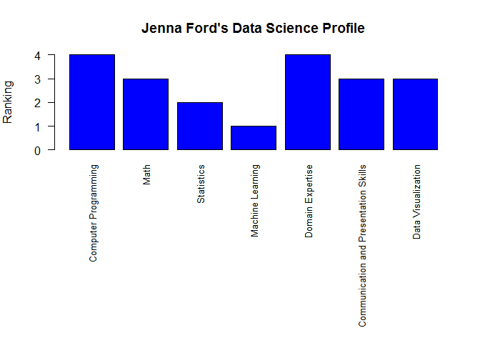

##  Data Science Profile


```r
Category <- c("Computer Programming","Math","Statistics","Machine Learning","Domain Expertise","Communication and Presentation Skills","Data Visualization")
Ranking <- c(4,3,2,1,4,3,3)
jenna <- data.frame(Category,Ranking)
```

## Bar Graph


```r
op <- par(mar=c(14,4,4,2))
barplot(jenna$Ranking,names.arg=jenna$Category,ylab="Ranking",col="blue",main="Jenna Ford's Data Science Profile",cex.names=0.8,horiz=F,las=2)
```

<!-- -->

```r
rm(op)
```


